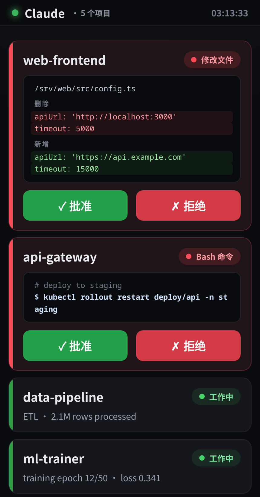
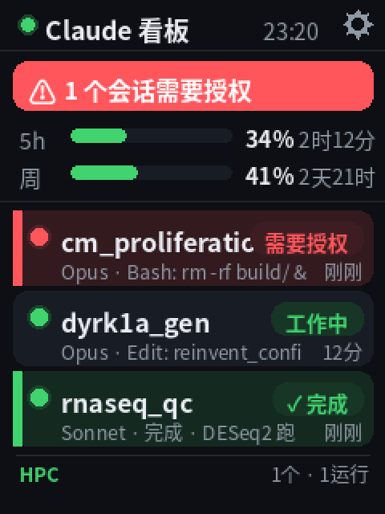

# Claude Status Board

English | [简体中文](README.zh-CN.md)

A status board for Claude Code. Put an old tablet on your desk or wall and you can tell from across the room what Claude is doing — running, idle, or waiting on you. When it wants to run a command or edit a file, you approve or reject on the tablet instead of switching back to the terminal.

The host runs a small Python server (standard library only). The tablet just loads one HTML page. Claude Code hooks connect the two. The page is plain ES5, so it renders fine on WebView as old as Android 6.



Prefer dedicated hardware? Drive a small **ESP32-S3 touch LCD** instead — the server renders the whole UI to an image and the board is a thin client, with on-screen approval, usage-quota bars, per-session detail, and an optional HPC monitor ([details below](#esp32-touch-lcd-board-server-rendered)). There's also a simpler [ESP32 traffic-light variant](esp32/) that drives a desk light off the same `/status` endpoint. On Windows, a [system-tray indicator](tray/) collapses the same aggregated state into one colored dot in your taskbar.



## The states

When several sessions run at once, each gets a row, keyed by session id and labeled with its working directory:

- green — running
- grey — idle, or waiting for your next message
- red — waiting on you (a permission prompt, or input)
- red with buttons — an action is paused for approval, with the command or diff shown

Whatever needs you sorts to the top.

## How it works

```
Claude Code session(s)                          Tablet / any browser
  hooks ── slot.py ─────────▶  slots/<sid>.json
           approve_gate.py ──▶  (writes red + req)        ┌────────────────────┐
                                                          │  GET /  (the board)│
  server.py  :8088  ── aggregates slots/ ───── /status ──▶│  polls every 1s    │
                     ◀── decisions/<req> ◀──── /decide ───│  [Approve][Reject] │
           approve_gate.py reads decision → allow / deny  └────────────────────┘
```

`server.py` serves the page and aggregates the per-session state files. `slot.py` is a hook that writes the current session's state to `slots/<session_id>.json` on each event. `approve_gate.py` runs on `PreToolUse`: guarded actions block until you tap, then it allows or denies.

## Setup

You need Python 3 (standard library) on the machine running Claude Code, and any device with a browser for the display. If the display is a separate machine, put both on the same private network — Tailscale works well.

```
git clone https://github.com/ychen0606/claude-status-board.git
cd claude-status-board
./start.sh      # serves on :8088
./install.sh    # prints the hooks block with the right absolute path
```

Paste the printed `"hooks"` block into `~/.claude/settings.json`; new sessions pick it up. Open `http://<host>:8088/` on the display. For autostart, add `@reboot /path/to/start.sh` to your crontab.

### Tablet as an always-on display

Get the tablet onto the same network (the Tailscale app, same account), install Fully Kiosk Browser, point it at the URL, and turn on keep-screen-on, start-on-boot, and fullscreen. In Android's developer options, enable "Stay awake" so the screen never sleeps while charging, and leave it plugged in.

## ESP32 touch-LCD board (server-rendered)

Instead of a tablet, you can drive a small ESP32-S3 + 2.8" ILI9341 touch LCD (e.g. LCDWIKI ES3C28P). The server renders the whole UI to a 240×320 PNG (anti-aliased CJK via Pillow + Noto), and the board just pulls the image and handles touch — so you restyle the UI by editing `board_render.py`, no reflashing.

Extra endpoints in `server.py`:

- `GET /board.png?view=&req=` — the current screen as a PNG
- `GET /board.json?view=&req=` — `{hash, led, bright, buttons:[{x,y,w,h,act,req}]}`: touch hitboxes plus a content hash so the board only refetches the image when it changes

It shows a session list (project · model · command · run-time), the 5-hour and weekly usage-quota bars, a red banner + RGB heartbeat when a session needs authorization (tap to approve, or just as a reminder when you approve in the terminal), a green "✓ done" highlight when a task finishes, optional HPC `squeue` jobs, auto-dim when idle / at night, a WiFi captive-portal for setup, persisted touch calibration, and over-the-air firmware updates. Tap any session for a detail view.

Server-side deps: `pip install Pillow` and a CJK font (Debian: `sudo apt install fonts-noto-cjk`). Usage-quota numbers come from [claude-hud](https://github.com/jarrodwatts/claude-hud): set `display.externalUsageWritePath` to `<repo>/usage.json` in `~/.claude/plugins/claude-hud/config.json`.

Firmware build/flash — arduino-cli setup, libraries, the `invert=true` panel note, OTA — is in [esp32-lcd/README.md](esp32-lcd/README.md).

## Remote approval

Off by default:

```
touch gate_enabled   # on
rm gate_enabled      # off
```

When it's on, `approve_gate.py` intercepts `Bash`, `Write`, `Edit`, `MultiEdit`, and `NotebookEdit` (change `GATED_TOOLS` to adjust). Bash commands already on your Claude Code allow-list still run without stopping — it reads `~/.claude/settings.local.json` and only pauses on actions you haven't approved before.

The tablet shows the command, a file preview, or a diff, with Approve and Reject. If nobody taps within `TIMEOUT` (90 seconds), it falls back to the normal keyboard prompt. It never auto-approves and never hangs. To stop gating file edits, drop `Write`/`Edit` from `GATED_TOOLS`.

## Configuration

| What | Where |
|------|-------|
| Port | `CLAUDE_BOARD_PORT` env var (default `8088`) |
| Stale-row timeout | `STALE` in `server.py` (default 1800s) |
| Guarded tools / approval timeout | `GATED_TOOLS`, `TIMEOUT` in `approve_gate.py` |
| Tablet UI text and colors | the `HTML` block in `server.py` |
| LCD-board UI (layout, colors, fonts) | `board_render.py` |
| HPC monitor (optional) | `CLAUDE_BOARD_HPC_HOST` (ssh host alias) + `CLAUDE_BOARD_HPC_USER` (default `$USER`) |
| LCD-board fonts | `CLAUDE_BOARD_FONT`, `CLAUDE_BOARD_FONT_BOLD` (default Noto Sans CJK) |

## Security

The server binds `0.0.0.0` with no authentication, so run it on a trusted network only — Tailscale, a firewalled LAN, that kind of thing. Don't expose port 8088 to the internet: when the gate is on, anyone who can reach `/decide` can approve actions. The board shows the commands and file contents Claude is about to touch, so treat the screen like your terminal.

## License

MIT — see [LICENSE](LICENSE).
